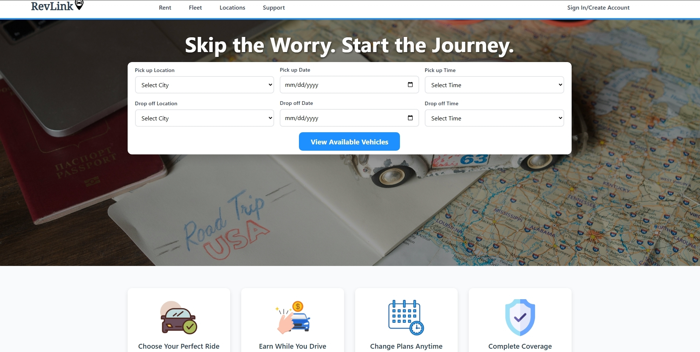

RevLink

This is a full-stack car rental platform with user authentication, real-time booking management, and includes Stripe payment processing. The purpose is to demonstrate end-to-end web development including secure payment processing, role based-access control, and important business logic.

Live Demo: revlinkrental.fwh.is

Admin: Admin1
Customer: Test1234
Password (Both): Abc1234567

**Demo Credit Card Numbers:**

**Payment Accepted:**
4242 4242 4242 4242 (Visa)
5555 5555 5555 4444 (Mastercard)
3782 822463 10005 (American Express)
6011 1111 1111 1117 (Discover)

**Declined Payment:**
4000 0000 0000 0002 (Generic decline)
4000 0000 0000 9995 (Insufficient funds)
4000 0000 0000 9987 (Lost card)
4000 0000 0000 9979 (Stolen card)

**Overview:**
This is a complete car rental management system that allows customers to browse vehicles, make reservations, and process secure payments. Admins can manage fleet inventory, track bookings, handle customer support tickets, and manage all transactions through an admin dashboard.

## Key Features

**Customer Features:**
- User registration and authentication system
- Browse vehicles by location, vehicle type, fuel type, and number of seats
- Real-time availability checking based on booking dates
- Secure payment processing using Stripe
- Booking management (view, modify, and cancel reservations)
- Payment method management through Stripe Customer Portal
- Driver's license verification required for first-time renters
- Support ticket submission system

**Admin Features:**
- Manage inventory
- Ability to view and manage all bookings
- View and manage transaction history
- Staff management capabilities
- Customer support ticket handling
- Vehicle maintenance tracking

## Technical Implementation

**Frontend:**
- HTML5, CSS3, JavaScript
- Bootstrap 5 for responsive design
- Leaflet.js for interactive location maps
- Dynamic content rendering with PHP
- Real-time form validation and user feedback

**Backend:**
- PHP for server-side logic and request handling
- PDO with prepared statements for secure database operations
- Session-based authentication with role-based access control (customer/admin/tech)
- Business logic for booking conflict prevention and date validation

**Database:**
- MySQL with normalized relational schema
- Foreign key constraints with CASCADE/RESTRICT rules for data integrity
- Separate tables for users, customer details, vehicles, bookings, payments, transactions, and maintenance tracking

**Payment Processing:**
- Stripe API integration for secure payment handling
- Customer Portal integration for payment method management
- Support for multiple payment methods per customer
- Test mode implementation for portfolio demonstration
- Payment intent tracking and transaction logging

## Database Schema Highlights

The application uses a well-structured relational database with proper foreign key relationships:
- Users table with role-based permissions (customer/admin/tech)
- Vehicles table with availability status tracking
- Customer bookings with date range validation
- Payment methods linked to Stripe
- Transaction records
- Support ticket system

## Installation

1. Clone the repository
2. Configure MySQL database:
   - Import the provided schema file
   - Update database credentials in `db_connect.php`
3. Set up Stripe:
   - Add your Stripe test API keys to the configuration
4. Deploy to PHP enabled web server
5. Ensure proper file permissions for upload directories

## Security Features

- Password hashing for user credentials
- Prepared statements to prevent SQL injection
- Session management with secure cookies
- Role-based access control throughout the application
- Stripe handles sensitive payment data

## What I Learned

- Implemented Stripe
- Designing normalized database schemas with proper relationships
- Implementing role based authentication
- Managing complex business logic (booking conflicts, data validation)
- Building responsive user interfaces with Bootstrap

## Future Enhancements

- Fix filter sidebar functionality for all options
- Expand user role system

## License

MIT

